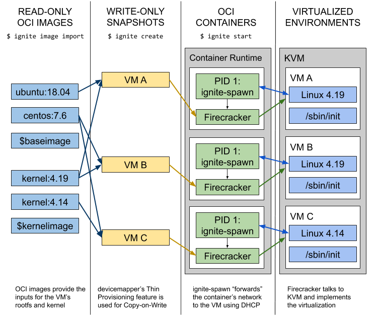

# Weave Ignite


Weave Ignite is an open source Virtual Machine (VM) manager with a container UX and
built-in GitOps management.

- Combines [Firecracker MicroVMs](https://aws.amazon.com/about-aws/whats-new/2018/11/firecracker-lightweight-virtualization-for-serverless-computing/) with Docker /
 [OCI images](https://github.com/opencontainers/image-spec) to unify containers and VMs.
- Works in a [GitOps](https://www.weave.works/blog/what-is-gitops-really) fashion and can
 manage VMs declaratively and automatically like Kubernetes and Terraform.

Ignite is fast and secure because of Firecracker. Firecracker is an
[open source KVM implementation](https://firecracker-microvm.github.io/) from AWS that is
optimised for [high security](https://github.com/firecracker-microvm/firecracker/blob/master/docs/design.md#threat-containment), isolation, speed and low resource consumption. AWS uses it as the foundation for their
serverless offerings (AWS Lambda and Fargate) that need to load nearly instantly while also
keeping users isolated (multitenancy). Firecracker has proven to be able to run
[4000 micro-VMs on the same host](https://github.com/firecracker-microvm/firecracker-demo)!

## What is Ignite?

**Read the announcement blog post here:** <https://www.weave.works/blog/fire-up-your-vms-with-weave-ignite>

Ignite makes Firecracker easy to use by adopting its developer experience from _containers_.
With Ignite, you pick an OCI-compliant image (Docker image) that you want to run as a VM, and then just
execute **`ignite run`** instead of **`docker run`**.  There’s no need to use VM-specific tools to build
`.vdi`, `.vmdk`, or `.qcow2` images, just do a `docker build` from any base image you want
(e.g. `ubuntu:18.04` from Docker Hub), and add your preferred contents.

When you run your OCI image using `ignite run`, Firecracker will boot a new VM in about 125 milliseconds (!) for you
using a default 4.19 Linux kernel. If you want to use some other kernel, just specify the `--kernel-image` flag,
pointing to another OCI image containing a kernel at `/boot/vmlinux`, and optionally your preferred modules. Next,
the kernel executes `/sbin/init` in the VM, and it all starts up. After this, Ignite connects the VMs to any CNI network,
integrating with e.g. Weave Net.

Ignite is a declarative Firecracker microVM administration tool, similar to how Docker manages runC containers.
Ignite runs VM from OCI images, spins VMs up/down at lightning speed,
and can manage fleets of VMs efficiently using [GitOps](https://www.weave.works/technologies/gitops/).

The idea is that Ignite makes Firecracker VMs look like Docker containers.
Now we can deploy and manage full-blown VM systems just like e.g. Kubernetes workloads.
The images used are OCI/Docker images, but instead of running them as containers, it executes
their contents as a real VM with a dedicated kernel and `/sbin/init` as PID 1.

Networking is set up automatically, the VM gets the same IP as any container on the host would.

And Firecracker is **fast**! Building and starting VMs takes just some _fraction of a second_, or
at most some seconds. With Ignite you can get started with Firecracker in no time!

## Use-cases

With Ignite, Firecracker is now much more accessible for end users, which means the ecosystem
can achieve a next level of momentum due to the easy onboarding path thanks to the docker-like UX.

Although Firecracker was designed with serverless workloads in mind, it can equally well boot a
normal Linux OS, like Ubuntu, Debian or CentOS, running an init system like `systemd`.

Having a super-fast way of spinning up a new VM, with a kernel of choice, running an init system
like `systemd` allows running system-level applications like the kubelet, which need to “own” the full system.

Example use-cases:

- Set up many secure VMs lightning fast. It's great for testing, CI and ephemeral workloads.
- Launch and manage entire “app ready” stacks from Git because Ignite supports GitOps!
- Run even legacy or special apps in lightweight VMs (eg for multi-tenancy, or using weird/edge kernels).

And - potentially - we can run a cloud of VMs ‘anywhere’ using Kubernetes for orchestration,
Ignite for virtualization, GitOps for management, and supporting cloud native tools and APIs.

### Scope

Ignite is different from Kata Containers or gVisor. They don’t let you run real VMs, but only wrap a container in a VM layer providing some kind of security boundary (or sandbox).

Ignite on the other hand lets you run a full-blown VM, easily and super-fast, but with the familiar container UX. This means you can “move down one layer” and start managing your fleet of VMs powering e.g. a Kubernetes cluster, but still package your VMs like containers.

## Installing

Please check out the [Releases Page](https://github.com/weaveworks/ignite/releases).

How to install Ignite is covered in [docs/installation.md](docs/installation.md) or on [Read the Docs](https://ignite.readthedocs.io/en/stable/installation.html).

Guidance on Cloud Providers' instances that can run Ignite is covered in [docs/cloudprovider.md](docs/cloudprovider.md).

## Getting Started

**WARNING:** In it's `v0.X` series, Ignite is in **alpha**, which means that it might change in backwards-incompatible ways.

[](https://asciinema.org/a/252221)

Note: At the moment `ignite` and `ignited` need root privileges on the host to operate
due to certain operations (e.g. `mount`). This will change in the future.

```bash
# Let's run the weaveworks/ignite-ubuntu OCI image as a VM
# Use 2 vCPUs and 1GB of RAM, enable automatic SSH access and name it my-vm
ignite run weaveworks/ignite-ubuntu \
    --cpus 2 \
    --memory 1GB \
    --ssh \
    --name my-vm

# List running VMs
ignite ps

# List Docker (OCI) and kernel images imported into Ignite
ignite images
ignite kernels

# Get the boot logs of the VM
ignite logs my-vm

# SSH into the VM
ignite ssh my-vm

# Inside the VM you can check that the kernel version is different, and the IP address came from the container
# Also the memory is limited to what you specify, as well as the vCPUs
> uname -a
> ip addr
> free -m
> cat /proc/cpuinfo

# Rebooting the VM tells Firecracker to shut it down
> reboot

# Cleanup
ignite rm my-vm
```

For a walkthrough of how to use Ignite, go to [**docs/usage.md**](docs/usage.md).

## Getting Started the GitOps way

Ignite is a “GitOps-first” project, GitOps is supported out of the box using the `ignited gitops` command.
Previously this was integrated as `ignite gitops`, but this functionality has now moved to `ignited`,
Ignite's upcoming daemon binary.

In Git you declaratively store the desired state of a set of VMs you want to manage.
`ignited gitops` reconciles the state from Git, and applies the desired changes as state is updated in the repo.
It also commits and pushes any local changes/additions to the managed VMs back to the repository.

This can then be automated, tracked for correctness, and managed at scale - [just some of the benefits of GitOps](https://www.weave.works/technologies/gitops/).

The workflow is simply this:

- Run `ignited gitops [repo]`, where repo is an **SSH url** to your Git repo
- Create a file with the VM specification, specifying how much vCPUs, RAM, disk, etc. you’d like for the VM
- Run `git push` and see your VM start on the host

See it in action! (Note: The screencast is from an older version which differs somewhat)

[](https://asciinema.org/a/255797)

For the complete guide, see [docs/gitops.md](docs/gitops.md).

### Awesome Ignite

Want to see how awesome Ignite is?

Take a look at the [awesome-ignite](docs/awesome.md) page!

### Documentation

Please refer to the following documents powered by [Read the Docs](https://readthedocs.io/):

- **[Documentation Page](https://ignite.readthedocs.io/en/stable)**
- [Installing Ignite](https://ignite.readthedocs.io/en/stable/installation)
- [Scope and Dependencies](https://ignite.readthedocs.io/en/stable/dependencies)
- [Getting Started Walkthrough](https://ignite.readthedocs.io/en/stable/usage)
- [Declaratively Controlling Ignite](https://ignite.readthedocs.io/en/stable/declarative-config)
- [Networking and Multi-Node](https://ignite.readthedocs.io/en/stable/networking)
- [CLI Reference](https://ignite.readthedocs.io/en/stable/cli/ignite/)
- [API Reference](https://ignite.readthedocs.io/en/stable/api/)

### Frequently Asked Questions

See the [FAQ.md](https://ignite.readthedocs.io/en/stable/FAQ) document.

### Architecture



Want to know how Ignite really works under the hood?
Check out this [TGIK](https://github.com/heptio/tgik) session from [Joe Beda](https://twitter.com/jbeda) about it:

[](https://youtu.be/aq-wlslJ5MQ)

### Base images and kernels

A _base image_ is an OCI-compliant image containing some operating system (e.g. Ubuntu).
You can follow normal `docker build` patterns for customizing your VM's rootfs.

A _kernel image_ is an OCI-compliant image containing a `/boot/vmlinux` (an uncompressed kernel)
executable (can be a symlink). You can also put supporting kernel modules in `/lib/modules`
if needed. You can mix and match any kernel and any base image to create a VM.

As the upstream `centos:7` and `ubuntu:18.04` images from Docker Hub don't
have all the utilities and packages you'd expect in a VM (e.g. an init system), we have packaged some
reference base images and a sample kernel image to get started quickly.

You can use the following pre-built images with Ignite. They are built on the normal Docker Hub images,
but add `systemd`, `openssh`, and similar utilities.

#### Base Images

- [Ubuntu 18.04 Dockerfile](images/ubuntu/Dockerfile) (`weaveworks/ignite-ubuntu`)
- [CentOS 7 Dockerfile](images/centos/Dockerfile) (`weaveworks/ignite-centos`)
- [Amazon Linux 2 Dockerfile](images/amazonlinux/Dockerfile) (`weaveworks/ignite-amazonlinux`)
- [The Firecracker Team's Alpine Image](images/alpine/Dockerfile) (`weaveworks/ignite-alpine`)

These prebuilt images can be given to `ignite run` directly.

#### Kernel Images

- [Default Kernel Image](images/kernel/Dockerfile) (`weaveworks/ignite-kernel`)
- [The Firecracker Team's Kernel](images/amazon-kernel/Dockerfile) (`weaveworks/ignite-amazon-kernel`)

#### Tutorials

- [Guide: Run a HA Kubernetes cluster with Ignite and kubeadm](images/kubeadm) (`weaveworks/ignite-kubeadm`)
- [Guide: Run a set of Ignite VMs with Footloose](docs/footloose.md)

## Contributing

Please see [CONTRIBUTING.md](CONTRIBUTING.md) and our [Code Of Conduct](CODE_OF_CONDUCT.md).

Other interesting resources include:

- [The issue tracker](https://github.com/weaveworks/ignite/issues)
- [The list of milestones](https://github.com/weaveworks/ignite/milestones)
- [The Roadmap](docs/roadmap.md)
- [CHANGELOG.md](CHANGELOG.md)

## Getting Help

If you have any questions about, feedback for or problems with `ignite`:

- Invite yourself to the <a href="https://slack.weave.works/" target="_blank">Weave Users Slack</a>.
- Ask a question on the [#ignite](https://weave-community.slack.com/messages/ignite/) slack channel.
- [File an issue](https://github.com/weaveworks/ignite/issues/new).
- Join [weaveworks-ignite@googlegroups.com](https://groups.google.com/forum/#!forum/weaveworks-ignite) for calendar invites to calls and edit access to community documents.
- Join our [developer meetings](https://docs.google.com/document/d/1fv8_WD6qXfvlIq7Bb5raCGyBvc42dNF-l8uaoZzoUYI/edit).

Your feedback is always welcome!

## Maintainers

- Leigh Capili, [@stealthybox](https://github.com/stealthybox)
- Chanwit Kaewkasi, [@chanwit](https://github.com/chanwit)
- Sunny, [@darkowlzz](https://github.com/darkowlzz)

## License

[Apache 2.0](LICENSE)
